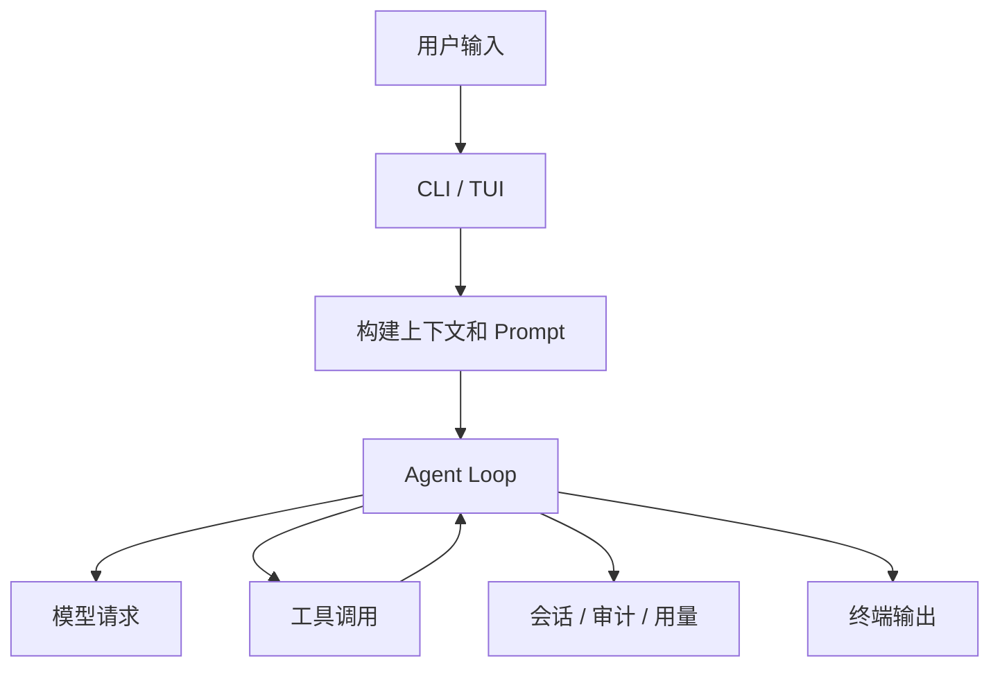

# 整体视图

q-code 是一个 TypeScript CLI Agent。它把模型、工具、上下文、会话和终端界面接在一起。

## 一次请求怎么走

## 主要层次

| 层 | 负责什么 |
| --- | --- |
| `src/cli` | 启动、参数、主循环 |
| `src/context` | system prompt、运行环境、压缩、任务和记忆 |
| `src/agent` | ReAct 循环、重试、循环检测 |
| `src/tools` | 文件、shell、搜索、计划、任务、Agent 等工具 |
| `src/agents` | SubAgent、后台任务、Agent Teams、worktree |
| `src/terminal` | Ink TUI、输入、事件和状态栏 |
| `src/session` | JSONL 会话持久化 |
| `src/observability` | 审计、Langfuse、运行指标 |

## 设计取向

- 入口薄，重模块动态加载。
- 工具统一走注册表，方便审计、Hook 和并发控制。
- 动态上下文尽量放在本轮 transient user context，稳定 system prompt 前缀尽量不变。
- 长输出落盘，只把摘要和路径带回主上下文。
